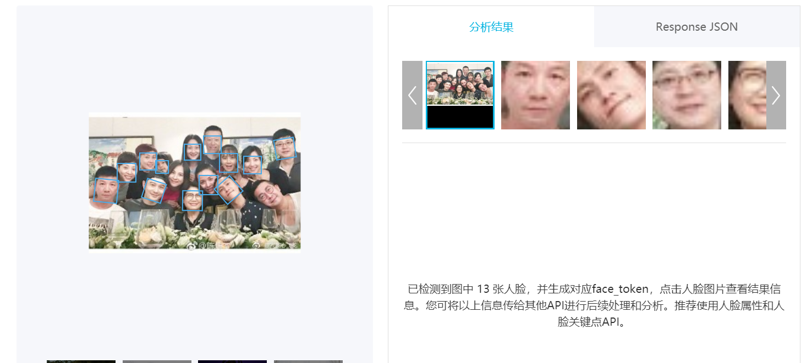
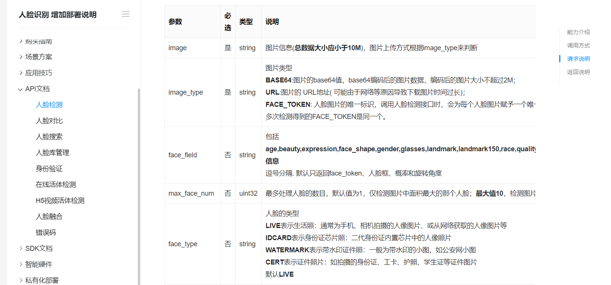
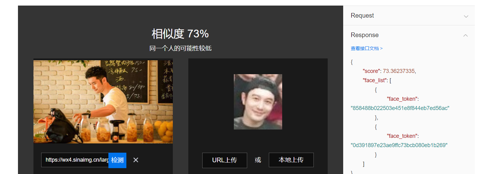
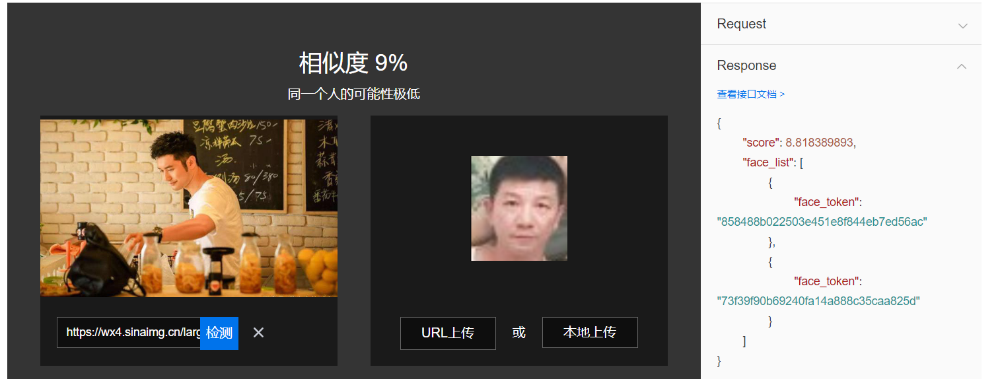
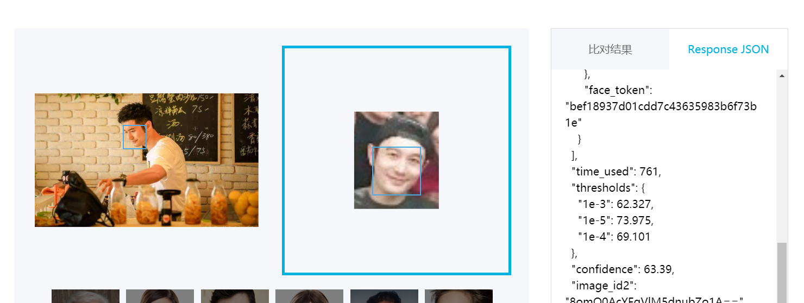
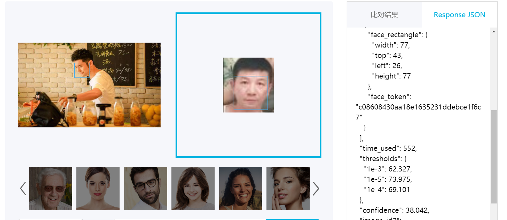

## 毕业相册

### 使用环境/项目形式：

微信或者抖音的小程序

### 需求

两大社交平台，由于都具备大量的用户，所以在推广和使用方面会更加快捷，加上微信小程序上，相应的竞争产品还相对较少，大多都是使用ai处理版权等问题，还有就是通过人脸一键识别所有有该人出现的图片照片，却没有人去解决照片显示的好坏给人的体验带来的影响的问题。而抖音小程序更是由于2019年才开放，所以还无竞争。

### 痛点：

无法快速找到有关人物在图片的什么地方

### 价值宣言：

在众多人群中，找到自己或者同学对应的位置

### Api使用情况：

人脸识别（人脸检索、人脸对比）
api类别|功能|输入|输出|优先级
:--|:--|:--|:--|:--
人脸检测|生成人员id|用户上传的合照|合照图片中每个人像的id|次优
人脸对比|头像锁定|用户人脸的照片|用户上传的图片对应的人像id|优

### API2.使用比较分析

	
#### 人脸检测比较
平台名称|图片|识别人脸数量|本来人脸数量
:--|:--|:--|:--
face++||13|15
百度||10|15

从测试结果来看，两家平台都未达成检测到全部人脸的级别。

但由于百度人脸检测有人脸上限，考虑到我们可能涉及到要检测有几百人脸的照片，所以face++更加合适

#### 人脸对比比较

平台名称|图片1|相似度|图片2|相似度
:--|:--|:--|:--|:--
百度||73%||9%
face++||63%||38%

通过以上对比分析，我们能够发现在判断是否为同一个人时，百度的似乎更加可信，可是如果从对比后的结果来看，在没有其它条件介入时
两者其实都是判断准确的，而在我们的服务中，我们只需要达到置信度最高即可判断照片位置，所以这种置信度之间的差距并不会影响最终的结果判断。

#### 分析api需求使用情况
可以使用人脸检索并输入有关人物信息，通过分享图片的方式，让其它和相册有关的人员来完善它，以节省成本。但反而会面临着效率可能不高的问题。

只有结合人脸检索在同时加上相关人员补充和修正的身份信息才可以即提高效率，也可以解决人脸检索面临的判断错误的问题，不过这一问题会随着技术的发展，从而得到一定的改善。

人脸对比由于特性使然，作用于锁定已记录好的图片信息，所以它是一个基于置信度进行判断的一项功能。我们对它进行使用情况分析，会发现人们更在意的往往是有没有仅需一次，就识别到位。这种时候我们只需要通过不打开弹窗干扰的情况下进行人脸对比，就是ok的，然后让图片打开位置为这种方式锁定的图片位置即可。而这整个过程，用户是不知情的，也就是说，用户不会因此而感到我们提供了该项服务，也就不会对该服务产生不好的印象。

#### 产品功能：

结合要使用的api来说，我们的功能主要分为2点，一是收集信息，也就是用户上传图片，经过我们的信息匹配和用户的修改后，才可使用下一功能。二是展示信息，也就是识别用户人脸和上传图片对比，从而找到有关位置，并以默认方式移动到该位置。

